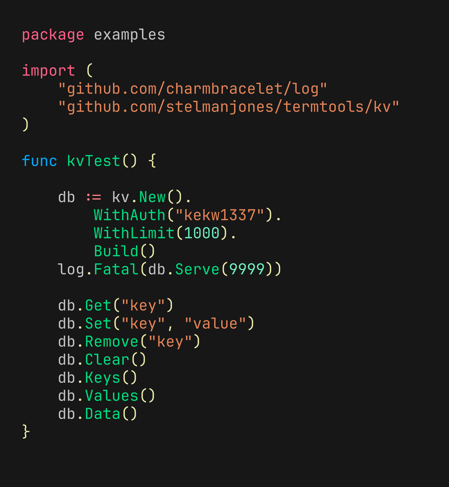

# KV

[](https://pkg.go.dev/github.com/stelmanjones/termtools/kv)
[](https://goreportcard.com/report/github.com/stelmanjones/termtools/kv)
[](https://github.com/stelmanjones/termtools/blob/main/LICENSE)



## Install

```go
import "github.com/stelmanjones/termtools/kv"
```

