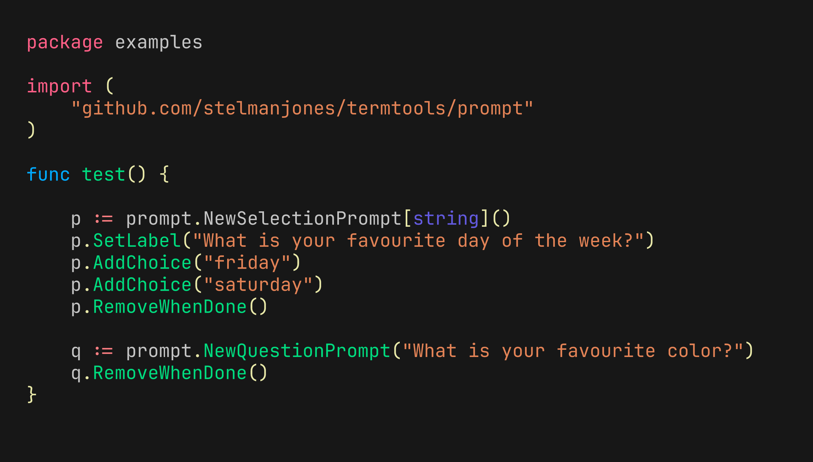

# Prompts

[](https://pkg.go.dev/github.com/stelmanjones/termtools/prompt)
[](https://goreportcard.com/report/github.com/stelmanjones/termtools/prompt)
[](https://github.com/stelmanjones/termtools/blob/main/LICENSE)


The Prompt module is a part of the `termtools` package and provides a set of
interactive prompts for command-line interfaces. It includes selection prompts,
question prompts, and confirmation prompts.


**Example**


## Install
```go
import "github.com/stelmanjones/termtools/prompt"
```

## Features

- **Selection Prompt**: Allows users to select an option from a list of choices.
  Choices can be added using
  the `AddChoice` methods.

```go
p := prompt.NewSelectionPrompt[int]()
p.AddChoice(1)
p.AddChoices(2,3,4,5,6,7)
p.RemoveWhenDone()
result, err := p.Run()
```

- **Question Prompt**: Asks users a question and waits for their input. 

```go
q := prompt.NewQuestionPrompt("What is your name?")
result, err := q.Run()
```

- **Confirmation Prompt**: Asks users a yes/no question.

```go
c := prompt.NewConfirmationPrompt("Are you sure?")
result, err := c.Run()
```

