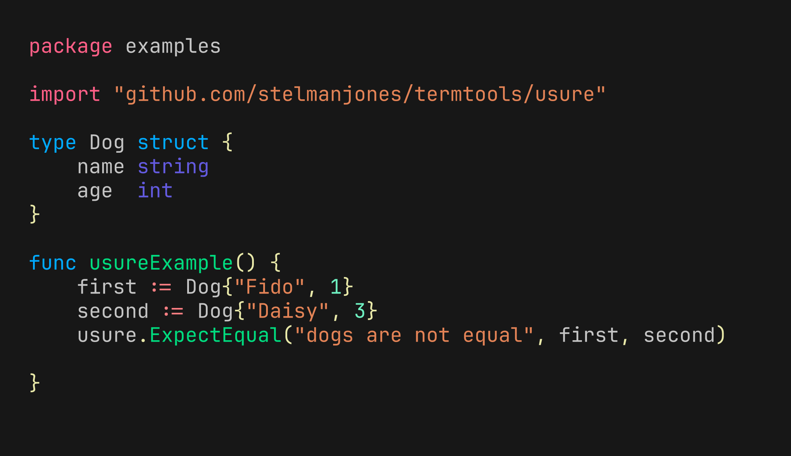
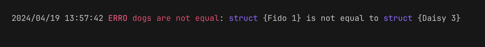

# Usure

[](https://pkg.go.dev/github.com/stelmanjones/termtools/usure)
[](https://goreportcard.com/report/github.com/stelmanjones/termtools/usure)
[](https://github.com/stelmanjones/termtools/blob/main/LICENSE)

A tiny and simple testing library

**Example**

 
**Output** 


## Install
```go
import "github.com/stelmanjones/termtools/usure"
```

## Features

- **Nil Check**: Checks if the provided value is nil.

```go
result := usure.Nil(value)
```

- **Not Nil Check**: Checks if the provided value is not nil.

```go
result := usure.NotNil(value)
```

- **Instance Check**: Checks if the two provided values are of the same type.

```go
result := usure.IsInstance(value1, value2)
```

- **Equality Check**: Checks if the two provided values are equal.

```go
result := usure.Equal(value1, value2)
```

- **Inequality Check**: Checks if the two provided values are not equal.

```go
result := usure.NotEqual(value1, value2)
```

- **Expect Equality**: Logs an error message if the two provided values are not equal.

```go
usure.ExpectEqual("Values should be equal", value1, value2)
```

